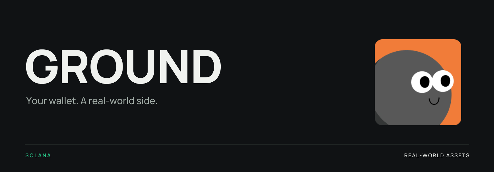
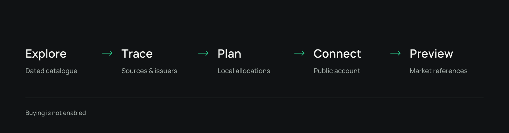
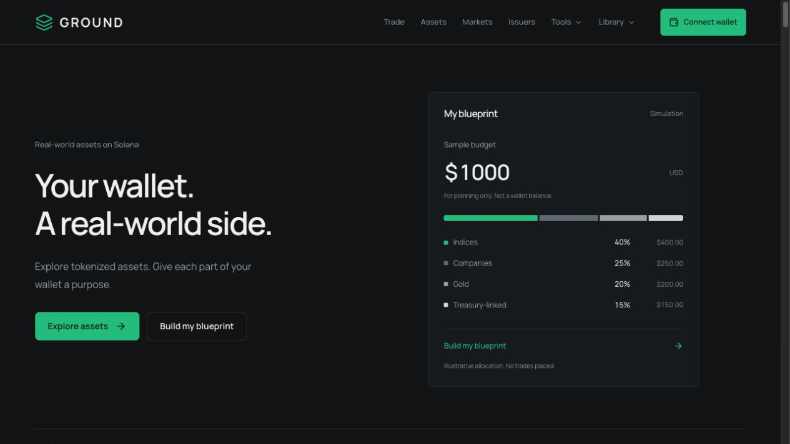
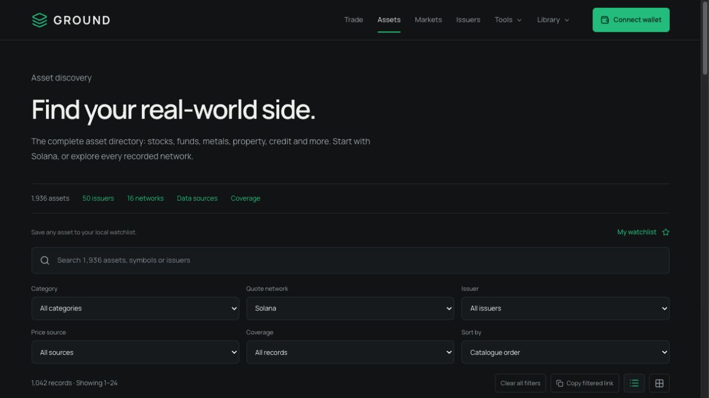

<p align="center">
  
</p>

<p align="center">
  A Solana-first workspace for the real world behind your tokens.
</p>

<p align="center">
  <a href="https://ground-rwa.vercel.app"><strong>Website</strong></a> &nbsp;·&nbsp;
  <a href="docs/THESIS.md"><strong>Thesis</strong></a> &nbsp;·&nbsp;
  <a href="docs/modules/catalogue.md"><strong>Catalogue</strong></a> &nbsp;·&nbsp;
  <a href="docs/METHOD.md"><strong>Method</strong></a> &nbsp;·&nbsp;
  <a href="docs/API.md"><strong>API</strong></a> &nbsp;·&nbsp;
  <a href="docs/ROADMAP.md"><strong>Roadmap</strong></a>
</p>

<p align="center">
  <a href="docs/modules/wallet.md"></a>
  <a href="docs/modules/catalogue.md"></a>
  <a href="https://github.com/johh7653-cell/ground-rwa/actions/workflows/ci.yml"></a>
  <a href="LICENSE"></a>
</p>

---

## The idea

A ticker tells you what a token is called. It rarely tells you what sits behind it.

GROUND connects an asset to its issuer, product structure, source trail and market reference. Stocks, funds, metals, property and credit become a library you can explore, compare and organize around your own budget.

**Understand the asset. Follow the source. Build your own plan.**

## The system

One codebase, six connected components.

| Component | Role | What you can inspect |
| :--- | :--- | :--- |
| [**ground-workspace**](docs/modules/workspace.md) | The front door | Discovery, asset details, watchlists, allocation tools and Trade preview |
| [**ground-catalogue**](docs/modules/catalogue.md) | The source library | 1,936 asset records, 50 issuers, 16 categories and original identity media |
| [**ground-market**](docs/modules/market.md) | The market context | Independently fetched references, token/network matching and dated archive curves |
| [**ground-wallet**](docs/modules/wallet.md) | The public account | Wallet Standard connection, account changes and native SOL balance |
| [**ground-interface**](docs/modules/interface.md) | The public API | Implemented catalogue, asset, issuer, source, market-reference and balance endpoints |
| [**ground-canon**](docs/modules/canon.md) | The published method | Thesis, calculation rules, data provenance, architecture and roadmap |

## From discovery to a plan

<p>
  
</p>

| Step | What happens |
| :--- | :--- |
| **Explore** | Search every product, filter the directory and open the underlying record. |
| **Trace** | Follow its issuer, addresses, sources and dated market observations. |
| **Plan** | Build a category Blueprint or asset Basket. Save, export and restore your allocations. |
| **Connect** | Choose a compatible Solana wallet and read the public account's SOL balance. |
| **Preview** | Select a Solana asset and amount. Inspect a market reference and indicative quantity. |

## Inside the workspace

<p>
  <a href="docs/modules/workspace.md"></a>
  <a href="docs/modules/catalogue.md"></a>
</p>

A quiet black interface, complete product records and practical tools. Discovery and planning work without a wallet.

## Data with a source trail

| Library | Coverage |
| :--- | :--- |
| Asset records | **1,936** |
| Issuers | **50** |
| Categories | **16** |
| Networks in the source archive | **16** |
| Primary Solana quote-network records | **1,042** |
| Archive date | **23 September 2026** |

Historical observations keep their original dates. Current market references show their own fetch time and source. Unknown values remain unknown; metal units are labelled and converted explicitly.

[Read the data standard →](docs/METHOD.md)

## Current stage

The research workspace, public APIs, wallet connection and Trade preview are implemented. Trade shows indicative quantities from indexed market references. **Buying and transaction signing are not enabled.**

| Available | Next integration |
| :--- | :--- |
| Full catalogue, sources and historical curves | Executable routes and fee breakdown |
| Watchlists and validated local allocation plans | Token units, simulation and wallet approval |
| Public Solana account and SOL balance | Transaction submission and confirmation |
| Independent market references and Trade preview | Reproducible live probes and fill verification |

[Implementation roadmap →](docs/ROADMAP.md) &nbsp; [Verification record →](docs/VERIFICATION.md)

The public workspace is available at [ground-rwa.vercel.app](https://ground-rwa.vercel.app). [Deployment guide →](docs/DEPLOYMENT.md)

## Build with GROUND

**Next.js 16 · React 19 · TypeScript · Wallet Standard · CSS Modules**

Requires Node.js 22 or later.

```sh
npm ci
npm run dev
```

Open [127.0.0.1:4345](http://127.0.0.1:4345).

```sh
npm run check
npm test
node scripts/verify-production.mjs
```

GitHub Actions checks Node.js 22 and 24, including production archive APIs.

[Development guide →](docs/DEVELOPMENT.md) &nbsp; [API reference →](docs/API.md) &nbsp; [Contributing →](CONTRIBUTING.md)

---

<p align="center">
  <br />
  <strong>Your wallet. A real-world side.</strong><br />
  <sub>Product names and imagery identify their respective issuers. GROUND does not issue the listed assets.<br />
  Original archive provenance and the <a href="LICENSE">MIT licence</a> are retained.</sub>
</p>
