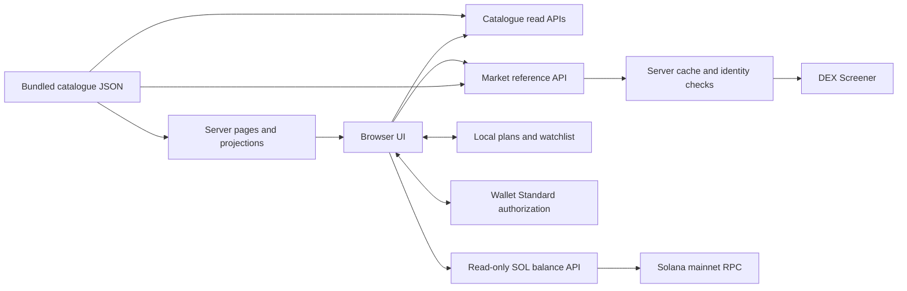

# GROUND architecture

GROUND is a Next.js App Router application for researching real-world asset tokens, planning allocations and viewing a Solana wallet connection. Its current implementation separates a dated catalogue, fetched market references, browser-local plans and read-only wallet information. Buying is a preview awaiting an execution service.

The checked-in package uses Next.js 16.3.5, React 19.2.4, TypeScript, CSS modules, local Manrope fonts, Lucide icons and `@wallet-standard/app`. Node.js 22 or later is required. The bundled JSON and identity media are sufficient to run the application; the archive import scripts are maintenance tools, not startup requirements.

## Data flow



There is no application database, account-login backend, private-key store, order book or transaction-submission service. Market and RPC requests run on the server. Wallet authorization and planning edits happen in the browser.

## Source layout

| Location | Responsibility |
| --- | --- |
| `src/app/` | Pages, metadata, layout, error states and App Router handlers |
| `src/app/api/` | Implemented JSON read APIs, documented in [API.md](API.md) |
| `src/components/` | Catalogue exploration, asset details, planning tools, market panels, wallet UI and shared navigation |
| `src/lib/catalogue.ts` | Saved archive types, slug lookup, labels, source groups and formatting |
| `src/data/catalogue.json` | Complete dated catalogue, with preserved source fields and nulls |
| `src/lib/assets.ts` | Eleven curated Solana references with additional product-rights/source explanations |
| `src/lib/catalogue-media.ts` and `src/data/catalogue-media-map.json` | Asset-slug and issuer-name lookup for local identity media |
| `public/catalogue-media/` | Bundled asset and issuer identity images |
| `src/lib/live-market.ts` | Provider-independent quote parsing, identity checks, TTL cache and concurrency helpers |
| `src/lib/live-market-server.ts` | Server-only DEX Screener adapter |
| `src/lib/catalogue-tools.ts` | Basket validation, saved-price calculations, exact probe estimates and random sampling |
| `src/lib/blueprint.ts` | Category allocations, chart values and versioned Blueprint validation |
| `src/lib/plan-io.ts` | Plan-file validation and explicit local import with rollback attempts |
| `src/lib/watchlist.ts` | Versioned local saved references and explicit invalid-record recovery |
| `src/lib/wallet.ts` | Address/account validation and Wallet Standard connection lifecycle |
| `src/lib/project.ts` | Owner-supplied project channels; empty values produce no placeholder links |
| `scripts/` | Archive/media import tools and read-only HTTP verification |
| `docs/` | API, architecture, implementation notes, data audit and verification records |

Server pages read the catalogue and pass serializable projections to client components. The explorer receives only the fields it needs for search, filtering and display. Planning pages use `toToolAsset` to project tool fields. Type-only imports keep these helpers from importing the complete JSON into their browser modules. Local media lookup is separate from price-data lookup.

## Catalogue and editorial layers

The archive contains 1,936 assets, 50 issuers, 16 categories and 16 networks at `2026-09-23T13:00:28.464Z`. It retains 1,008 saved prices, 928 missing prices and 80 saved probes. The complete import and media provenance are described in [original-data-audit.md](original-data-audit.md).

Records are identified by unique slug. Names and symbols do not replace that identity: similarly named share classes can be separate records. `chain` retains the observation network; `chains` retains supported deployments. The default asset explorer starts with the 1,042 primary Solana observations, while all networks remain available. Supporting Solana does not relabel an archived Ethereum or BNB Chain price as Solana data.

The 11 curated records in `assets.ts` add product descriptions, rights, eligibility and official-document references. They are an editorial supplement, not a replacement for the full archive or proof that every catalogue asset has been independently reviewed. They also supply the optional product references in Blueprint.

Missing prices, addresses, liquidity and metadata remain unknown. The `priceSource` coverage groups distinguish DEX observations, Jupiter saved prices, issuer product prices, issuer NAV and missing prices. These counts are derived from saved records. Historical OPEN/THIN/WATCH classifications do not become current trading approvals or safety scores.

Archive `pairUrl` values can be token-index links. Product links and issuer sites explain provenance; they do not establish a connected trading venue, partnership or redemption service. Identity images are local display assets, not claims of partnership.

## Pages and navigation

| Route | Current behavior |
| --- | --- |
| `/` | Catalogue overview, asset shelves, saved coverage and budget-reference exploration |
| `/assets/` | Search, category/network/issuer/source/coverage filters, sorting, list/grid views and pagination |
| `/assets/[slug]/` | Full archive identity, dated data, source links and curated explanations where available |
| `/a/[slug]/` | Compatibility redirect to the unified asset detail route |
| `/markets/` | Category and network entry points into the catalogue |
| `/issuers/`, `/sources/`, `/stats/` | Saved issuer directory, source coverage and archive statistics |
| `/watchlist/` | References saved in this browser |
| `/basket/` | Asset-level budget and weight planner |
| `/blueprint/` | Four-category allocation planner |
| `/draw/` | Random exploration of a filtered catalogue pool |
| `/swap/` | Offline comparison using saved prices or exact recorded target-side samples |
| `/account/` | Saved-plan review, export/copy, explicit import and confirmed local-plan removal |
| `/trade/` | Solana buy preview, fetched market reference and real wallet connection entry |
| `/approach/`, `/docs/`, `/thesis/` | Product-rights, methodology and narrative explanations |

Catalogue filters are encoded in the URL. The client subscribes to URL/history changes, so shared filter links, browser Back/Forward and restored pages reflect the same filter state. `/assets/` defaults to Solana; `/watchlist/` defaults to all networks within the local saved references. UI pagination uses 24 rows. Sorting and coverage filters are client-page features, distinct from the narrower JSON asset API.

## Fetched market references

`/api/quotes` accepts only catalogue slugs. The server resolves their recorded network/address; callers cannot inject an arbitrary provider URL or address. DEX Screener requests are grouped by network, with at most 24 addresses per batch, four provider requests in flight and an eight-second upstream timeout.

The adapter accepts a pair only when its chain and base-token address match the requested identity. Solana address comparison is case-sensitive. It chooses the matching positive-price pair with the highest reported liquidity, validates the returned pair-source URL and preserves unavailable numeric fields as null. That selection is a reference source, not a best executable route.

The process cache is keyed by network/address, deduplicates pending requests and retains results for 30 seconds after the batch completes. HTTP responses use `no-store`, but a manual refresh can still receive the same internally cached observation. Cached failures also retain their explicit error state during that TTL. This cache is not shared across independent deployment instances and is reset by process restarts or development reloads.

The archive is never overwritten by a fetched price. Available references carry a fetch timestamp; the provider's quote timestamp is unavailable. The asset-detail market panel loads manually, marks older references as stale after about two minutes and retains a previously fetched reference with an explicit warning if a later refresh fails. The Trade preview loads when its selected asset changes and supports manual refresh; its aging timer updates the stale label rather than polling the provider.

A provider failure is visible as an error or unavailable state. Historical values are not silently substituted into a failed market request. The API can return HTTP 200 with per-asset failure states, so consumers must inspect each quote's `status`.

## Planning tools and local persistence

Planning records belong to the browser origin. They are not synchronized to a server or across devices. Using a different hostname, port or deployed domain creates a different local storage area. Storage failures are reported; the UI does not claim a save succeeded when the value was not retained.

| Record | Key | Current schema |
| --- | --- | --- |
| Basket | `ground:basket:v1` | Version 1, name, sample USD budget, known asset slugs with integer basis-point weights, saved timestamp |
| Blueprint | `ground:blueprint:v1` | Version 1, sample USD budget, four whole-percentage weights and optional curated product references |
| Watchlist | `ground:watchlist:v1` | Version 1, distinct saved slugs |

Basket supports the full catalogue, sample budgets from $0.01 through $50,000,000 and weights with up to two percentage decimals. Saving requires a nonempty selection totaling exactly 10,000 basis points. Editing a weight does not normalize the others. Adding or removing assets explicitly splits the selection equally; adding an already present asset preserves its custom weights. A linked budget is applied to a draft without overwriting the saved record before the user saves.

Basket quantities use saved prices. A missing price leaves units unknown. Per-ounce metal prices are converted to gram references using `31.1034768` grams per troy ounce. Other calculations remain price-reference quantities; they do not apply token display multipliers or imply wallet holdings. Fees, gas and real execution costs are not invented.

Blueprint uses company exposure, broad indices, gold exposure and Treasury-linked categories. Default percentages are indices 40, companies 25, gold 20 and treasuries 15. Its budget limit is $10,000,000, percentages are whole numbers and saving requires a total of 100%. Under-allocation, over-allocation, zero totals and invalid values remain visible instead of being silently corrected.

Draw filters real records by category and supported deployment network, optionally requiring a saved price. Unlike the catalogue's primary observation-network filter, this tool checks `chains` as well as `chain`. It draws 1–12 distinct records without replacement. Adding new selections to a saved basket retains its budget/name and explicitly applies equal weights. Draw is asset discovery, not a paid lottery, prize service or investment strategy.

Swap uses either a price-only USD/reference-unit comparison or an exact saved probe rung. Recorded mode requires a measured archive, probe time and an exact USD-size match; it does not interpolate a new quote. Unfilled or unusable probes remain unavailable. Its target-side estimate excludes source exit costs, fees and bridges and does not send a swap.

Account exports/copies validated Basket and Blueprint records as a `GROUND` versioned planning bundle. Import reads a JSON file up to 1 MiB, or pasted JSON, entirely on the device; it does not upload it. The user reviews validation and explicitly imports. Only included plans are replaced, with rollback attempts and an explicit partial-failure message if storage restoration fails. Account removal requires an inline confirmation and removes only Basket/Blueprint keys; it does not clear the watchlist or unrelated browser data.

The watchlist is separate from the plan export. It preserves unknown saved references rather than claiming they are current assets. Invalid watchlist data is not automatically overwritten. Explicit recovery first preserves the original raw record under a recovery key, then starts a new list.

## Wallet authorization and balance

`WalletProvider` wraps the application layout and exposes `useWallet()`. `@wallet-standard/app` discovers compatible wallets; selecting one requests `standard:connect`. There is no automatic authorization prompt or simulated connected state. A browser without compatible wallet extensions displays official Phantom/Solflare download links and remains disconnected.

Accounts must authorize a Solana chain, decode to a 32-byte base58 address and have a matching 32-byte public key. EVM accounts are excluded. The connection store observes Wallet Standard account/feature changes, removed wallets and delayed connection results. Multiple authorized Solana accounts can be selected explicitly. A rejected wallet switch preserves the previous real connection.

When available, `standard:disconnect` is requested. Otherwise the site detaches locally; wallet permissions remain under the wallet's control. Wallet choice and address are not saved in application local storage. The native dialog handles focus, Escape dismissal, account copying and external explorer links.

For an authorized mainnet account, the provider reads `/api/wallet/balance`. That route uses the official mainnet RPC or a server-only HTTPS `SOLANA_RPC_URL`, verifies custom-provider genesis, requests confirmed native SOL and validates integer precision and slot. A 15-second bounded cache retains the reading timestamp. Errors stay errors; zero appears only after a valid zero RPC response. Tokens and USDC balances are not loaded. See [wallet-integration.md](wallet-integration.md) and [API.md](API.md) for the exact contract.

## Trade boundary

The current Trade page projects the archive's primary Solana records. It offers asset selection, a USDC-labelled sample amount, a slippage preference, fetched market data and a real wallet-connect action. The amount is a USD reference; it is not an observed USDC/USD rate, reserved funds or a spendable wallet balance. Indicative receive quantity is a market-price calculation before fees and impact; token display multipliers are not applied.

Buying remains disabled after connection. The slippage preference does not affect a transaction because no execution quote or transaction exists. No code requests a message/transaction signature, sends a transaction, confirms an order or issues a platform token.

A future execution adapter must introduce a separate executable quote contract with validated mint/network identity, token-unit conversion, minimum receive, fees and expiry, then an explicit wallet signing/submission/confirmation lifecycle. Product eligibility and redemption constraints also need a defined implementation. Those are future interfaces; no corresponding API routes are present now. Market-reference and archive APIs should remain separate from that future execution path.

## Configuration and verification

`SOLANA_RPC_URL` is the optional server-only network configuration. The owner’s GitHub repository is configured in `src/lib/project.ts`; contract/social/explorer/buy links remain empty until supplied. Empty values render no invented channels. `next.config.ts` disables the powered-by header and development indicator and uses unoptimized local images.

Run the repository's existing checks:

```sh
npm test
npm run lint
npm run typecheck
npm run build
```

With the server running, `node scripts/verify-catalogue-api.mjs` verifies the complete catalogue HTTP surface against local data. Pure tests cover plans, calculations, URL filters, watchlists, market identity/cache behavior and wallet connection/account boundaries. Wallet fixtures live only in tests and are not registered by the application. Actual extension approval needs a browser with the wallet installed; external providers may be unavailable or rate limited, and the UI/API preserve those failure states.
